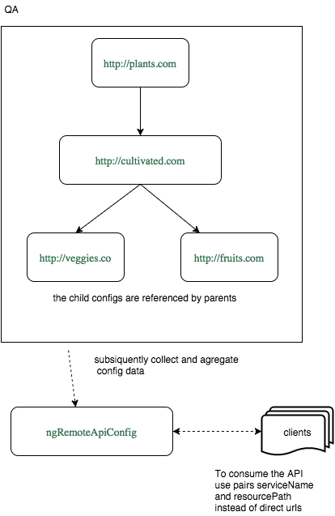

# ngRemoteAppConfig 

Simple AngularJS module created to keep environment configuration managed remotely from the single API endpoint.

## Motivation

In the case of API is being delivered from multiple servers with different endpoints to a set of client applications,
the problem of multiple coupling arises, when hard to maintain/move/restructure the API without changing clients configuration.
The similar issues appears during the production cycle, when the client app is pushed from developing to testing environments,
and further to the production.

This module provides API configuration object that is collected and agregated from multiple servers during application 
startup for use in $http calls.

## Installation

To add it in your project:

- install the package: `bower install ng-remote-app-config --save`

- add dependency to your Angular module: `.module('testApp', ['ngRemoteApiConfig'])`

- config the provider with api root and optional path:

```
.config(function(apiConfigServiceProvider){
  //tell where the configs are stored
  apiConfigServiceProvider.options.apiConfigPath = '/ui-json.json';
  apiConfigServiceProvider.options.apiRoot = 'http://plants.com';
});
```
It is good idea to use the [grunt-ng-constant](https://github.com/werk85/grunt-ng-constant) for configuration.
 
- inject the service in any of your controllers/services to have configuration promise, which will be resolved when all 
the data is collected: 
```
.controller('MainCtrl', function ($scope, apiConfigService, $log) {
   apiConfigService.get().then(function(configData){
     $log.debug('all set!');
     return configData; // to do something with it e.g. make a call with $http;
   });
 });
```

### Use httpConfigured

The service `httpConfigured(options)` is a wrapper around `$http(options)`. Simply use instead `options.url`
 the properties `options.serviceName` and `options.resourcePath`:
```
.controller('MainCtrl', function (httpConfigured, $log) {
  var options = {
    serviceName: 'cacti',
    method: 'GET',
    resourcePath: '/cut/the/thorns',
    data: 'Hedgehog' 
  };
   
  httpConfigured(options)
    .then(function (d) {
      $log.debug(d);
      expect(d.data).toEqual('best cactus - tested cactus'); 
    });
});
```
(you can still use urls though)

### The httpConfigured builder and shortcuts:

You can use the builder for getting a service object or work with a single resource, so the example from the previous section 
may look as:
```
.controller('MainCtrl', function (httpConfigured, httpC, $log) {

  var cactiService = httpConfigured.service('cacti');
  // do something else with the service like create resource...
  var  = cactiService.resource('/cut/the/thorns')
  // work with resorce, e.g get it: 
  thornsResource.get(data).then(function (d) { $log.debug(d); });
  // or build with data and post then:
  thornsResource.data(postData).post().then(function (d) { $log.debug(d); });
  // or use all together in one line:
  httpConfigured.service('cacti','/cut/the/thorns', postData).post();
  // or use shorcut for the service:
  httpConfigured.s.cacti('/cut/the/thorns', postData).post();
  // and use shortcut for the httpConfigured:
  httpC.s.cacti('/cut/the/thorns', postData).post();
  
})

```
### Server-side configuration

Conventionally, each configuration object should have the same path relatively to the root of the api. E.g. if the API hosted with URI 
the `http://kitty.cat/api`, the best way is to have the server to respond with the configuration object on the GET request
to the root of the api (apiConfigPath is set '/' by default). If we have the config on the different path, e.g. 
`http://kitty.cat/api/config/api.json`, we should set apiConfigPath = '/config/api.json' and it will be the same for the
other servers. Lets say, a part of the API is located on `http://cats-food/prices`. Then the configuration object should be 
available on `http://cats-food/prices/config/api.json`, so the client apps are able to retrieve it with the 
same path for each server. If there is no possibility to put the configuration on the external host, it can be done in the *$external* section.
 
Please have a look into the [ui-json.mock.js](test/mock/ui-json.mock.js) and Exhibit A for the sample configuration objects.

#### Format of the server-side configuration JSON

You can use any names for sections of the configuration those are not begin with the '$' character, otherwise 
they are ignored during merge. The names *$apiHosts* and *$external* are reserved:
- The *$apiHosts* section contains root urls on the other hosts, which supply the same configuration for the hosted API
- If there is no possibility to put the configuration on the external host, it can be done in the *$external* section, 
which contain the url of the root api URL and the configuration JSON.
The sections are merged with the priority of the parent, so it doesn't allow to override the value by another with joining 
another child configuration.  

### Section handlers
Section *services* used for creating service urls, and section *envName* is used for checking the basic consistency 
along environment. The developer can determine custom merging rules and value processors as it done in the options for default ones:
```
 self.options = {
        apiConfigPath: '/ ',
        apiRoot: 'http://localhost',

        sectionHandlers: {
          services: {
          // gets section object and API root URL, returns transformed section object
            valueProcessor: function (section, currentApiRoot) { 
              return _.mapValues(section, function (v) {
                return currentApiRoot + v
              })
            }
          },

          envName: {
            // merging rule: gets summary (merged) object and section object, returns result of merging 
            // in this case no merging happens , just return current
            reduceFunction: function (reduced, current) {
              if (reduced !== current) {
                $log.warn('*** envNames do not match: ', reduced, current);
              }
              return current;
            }
          }
        }
      };
```

## Testing

Running `grunt test` will run the unit tests with karma.

## Dependencies
```
    "angular": "^1.3.0",
    "lodash-angular-wrapper": "*"
```

## To Do 

[List](TODO.md)

## License

[MIT](https://opensource.org/licenses/MIT) (c) 2015, Dmitriy Kachko

## Kudos 
Thanks to those who created such a great js tools/libs as

_node, npm, bower, grunt, karma, jasmine, yoeman, lo-dash_ and _angular_ (LBNL)

### Exhibit A:




